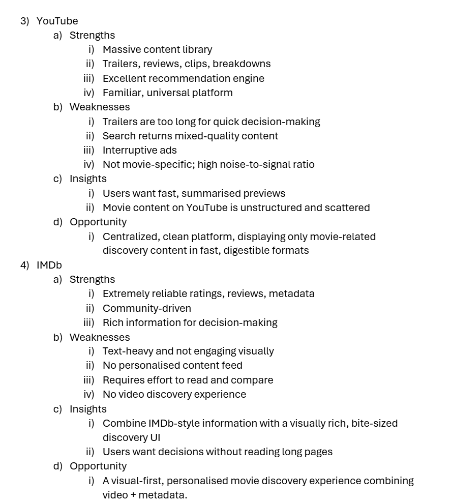
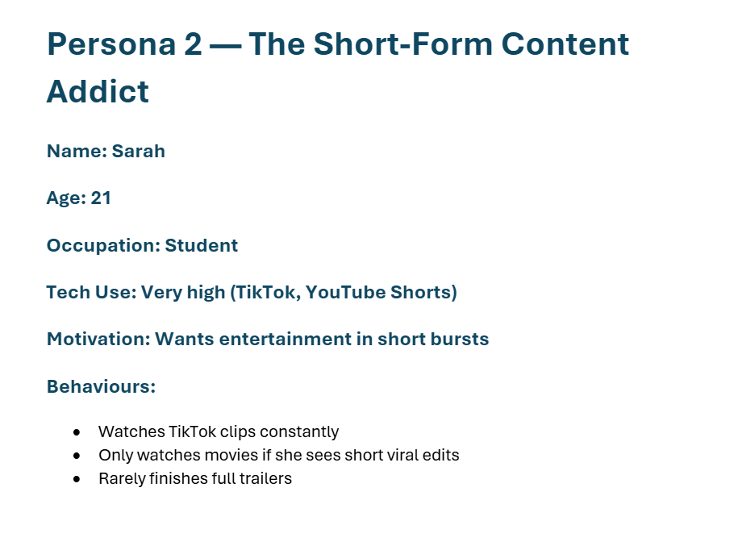
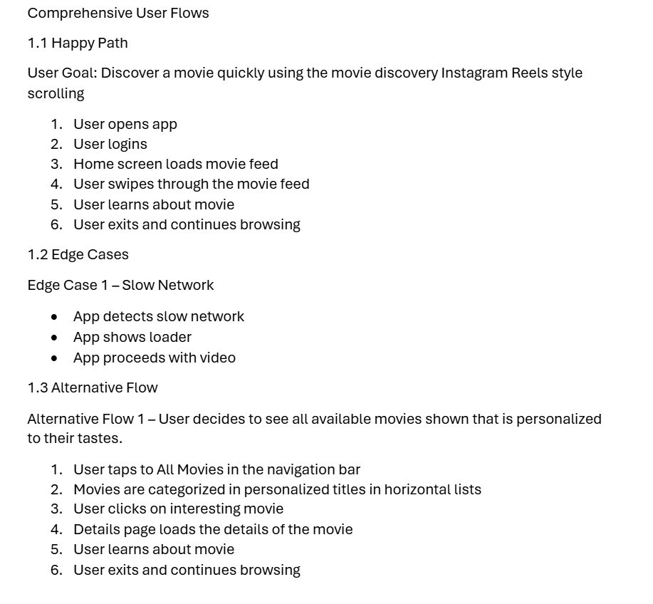
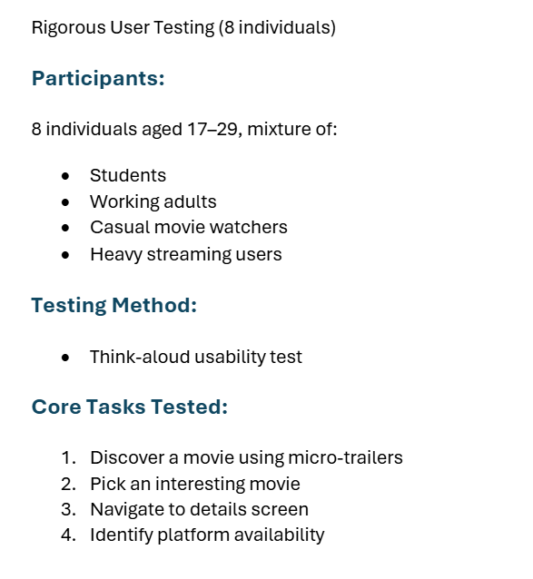
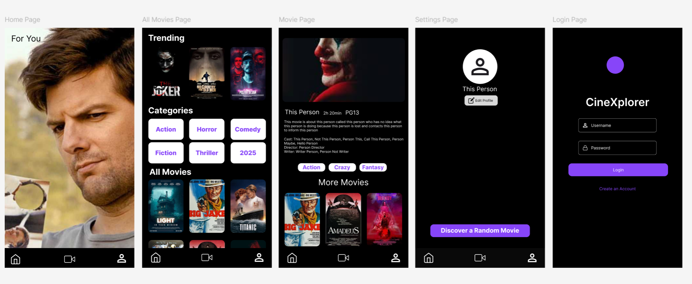
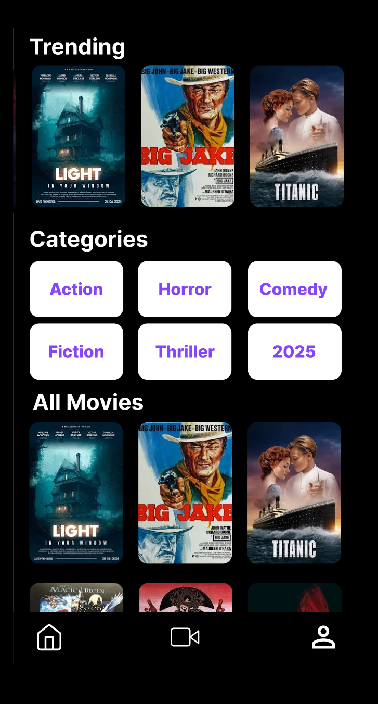
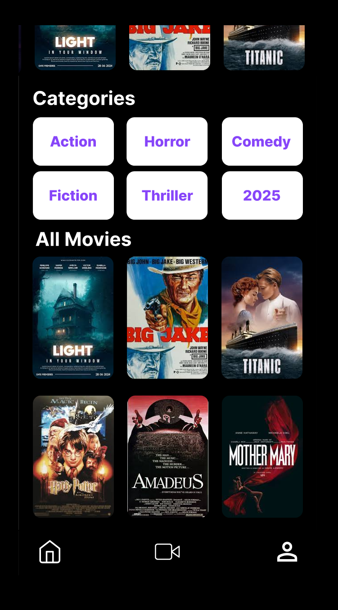

##Disclaimer
- This is a student assignment project for the Kotlin App
Development module at Ngee Ann Polytechnic. Developed for
educational purposes.

Collaborators
- Yong Kai Yu : S10258484 (GitHub: yongkaiyu)
- Tabio : S10258652 (GitHub: ITAccadh)
- Sarrinah : S10241803 (GitHub: srrnh)
- Jian Hui : S10257708 (GitHub: yonaginn)

Introduction
- This project is a mobile application prototype which is a personalized micro-trailer movie discovery app.
- The app assists users in discovering movies through engagement via short movie clips, displayed through a swipe-based interface inspired by modern social media content consumption.
- The app aims to reduce decision fatigue and help users discover more movies efficiently

Motivation/Objective

- Many users using streaming services like Netflix experience from choice fatigue and spend most of their time scrolling through large catalogs. Trailers are often long, and recommendations could feel repetitive.

Our objective is to create a mobile application that
- Helps users discover movies quickly and visually
- Uses short movie clips to give them a taste of what to expect
- Reduces the time on deciding what to watch
- Provides targeted personal movie suggestions
- Offers an intuitive interface with swipe-based interactions

- The Phase 1 prototype is aimed on displaying the basic features required to support the concept.

App Category

- Entertainment
- Movie Recommendation
- Media Streaming Support Tool
- Video Discovery

Declaration of LLM

- This project utilised the LLM of OpenAI ChatGPT, to assist with
- Brainstorming ideas and refining core concept
- Drafting of user research summaries
- Structuring documentation
- Clarifying Android development concepts
- Assisting in explanations regarding code logic

Tasks and features allocation of each member in team for Stage 1
- Research on what app to do for Stage 1 (Kai Yu)
- Creating and making of wireframes (Kai Yu)
- Conducting of user testing (Kai Yu)
- Login Page (Kai Yu)
- Login Database Implementation using Firebase(Kai Yu)
- Navigation UI Implementation (Kai Yu)
- Movie Shorts Player Discovery Feature on Home Screen (Kai Yu)
- Movie Database Implementation (Kai Yu)
- Horizontal List Trending Implementation (Kai Yu)
- Details Page Implementation (Kai Yu)
- Profile Page (Nagu)

Planned Tasks and Feature Allocation for each member in Stage 2
- Review Page and Functions (Kai Yu)
- Delete comment
- Comment under the content page for each movie
- Comment top comments when there are no movie selected 
- Daily Mystery Movie (Jian Hui)

Application Description
- CineXplorer is a discovery mobile application targeted towards movies. CineXplorer through its innovative features helps
users discover more targeted movies and reduce time on choosing what movie to watch. 
- One of CineXplorer's features helps quick discover movies through watching movie trailers in a Instagram/TikTok scrolling format.

Roles & Contributions of each member for Stage 1
- Research on what app to do for stage 1 (Kai Yu)
- Creating and making of wireframes (Kai Yu)
- Conducting of user testing (Kai Yu)
- Login Page (Kai Yu)
- Login Database Implementation using Firebase(Kai Yu)
- Navigation UI Implementation (Kai Yu)
- Movie Shorts Player Discovery Feature on Home Screen (Kai Yu)
- Movie Database Implementation (Kai Yu)
- Horizontal List Trending Implementation (Kai Yu)
- Details Page Implementation (Kai Yu)
- Profile Page (Nagu)

Research Questions

- Help to explore many domains before narrowing it down.

Daily Life & Pain Points

- What mobile applications do users spend the most time on?

- What are the most frustrating daily digital tasks?

- What causes users to feel overwhelmed, lost, or unproductive?

Usage

- What apps do users use daily or cannot live without?

- What apps did wish existed?

- What problems are not solved well by current mobile applications?

Research Method

- User Interviews (8 pax)

- Online Survey (20-30 responses)

- Competitor Scan (Instagram, CapCut, Netflix, Google, WhatsApp, Shopee )

Observed Behaviours

- Most users browse before watching

- Users are overwhelmed with options and abandon choices

- Short form video consumption are preferred

- Many prefer quick decisions over long browsing sessions

Interview Responses

- I think the YouTube and TikTok short clips help me decide faster. (P4)

- Trailers are long. I think quick previews of what I am shown would be nicer to have. (P2)

- I don’t think the content given to me is for me. (P5)

- I always finish my food before I even chose a movie to watch. (P1)

- I always take a lot of time choosing what I watch. (P8)

- I would love to have a movie to watch immediately with my family. (P3)

Survey Findings (24 responses)

How long do you spend deciding what to watch?

- 62%: 10 minutes to 25 minutes

Do you feel overwhelmed by too many choices?

- 75%: Yes

Do current recommendations feel relevant?

- 58% : No

Would short previews help decide faster?

- 79% : Yes

Do you watch TikTok short style clips?

- 2% : Frequently

Do you finish full trailers?

- 37% : Rarely 

Findings

- Majority suffers decision fatigue

- High Preference for short style video

- Users want faster discovery, not more content

- Recommendation systems are repetitive 

Competitive Observations

- Netflix “Too much scrolling”, “repetitive suggestions”

- YouTube: “Not organized for movies”

- TikTok: “Great for fast reviews”, “not made to watch movies” 

Insights from data

- People send significant time relaxing using digital entertainment.

- Entertainment is consistently one of the most used categories

- Users frequently complain about having difficulties on choosing what to watch 

Consolidated Insights

Insight 1 – Decision Fatigue

- Users waste time choosing what to watch and feel overwhelmed by endless options

Insight 2 – Long Trailers Are Not Effective

- Users prefer like short highlight clips which are the “juicy” parts than trailers

Insight 3 – Irrelevant Recommendations

- Users dont feel suggestions are to their tastes; want personalization

Insight 4 – Short Attention Span

- Short-form content (10-30 sec clips) strongly influences their decision

Insight 5 – Users Want Quick, Confident Choices

- They prefer simple, fast browsing over complex menus 

Ideas:

- Movie Discovery through Instagram Reels style scrolling

- Mood-Based Movie Picker

- Smart Playlists for Movies

- Social Movie Sharing Cards

- Eliminating categories Mode

- Swipe-to-Discover Interface

- Weekly Movie Digest 

3 Iterations & Improvements

Iteration 1 – Issues Found

- Database movie data takes a while to load

Fixes

- Used Room as local caching combined with Firestore database

Passing Criteria:

- 80% of users should complete tasks without assistance

Iteration 2 – Issues Found

- Color Scheme for Login page not fitting of theme

Fixes

- Updated color scheme to better suit page

Passing Criteria:

- 90% of users should approve color scheme

Iteration 3 – Issues Found

- Users want clearer icons

Fixes

- Added clearer icons to better reflect options

Passing Criteria

- All users approve the new icons 

Wireframes

Stage 2:

Feature overview (Comment & Rating System) - Yong Kai Yu

- Movie Selector Dropdown -> Users are able to choose which movie to comment on
- Comment Input Box -> Users are able to input their comment
- Comment Edit and Delete Functionality -> Users are able to edit and delete their own comment
- Clickable Star Rating Selector -> Users are able to rate the movie using a clickable interface of 5 stars. Users can choose up to 5 stars to indicate their rating 
- Comment Display -> Users are able to view comments from respective movies either from the Review Screen or under the detail page of the movie
- Firestore datastore + Room as local cache -> comment and rating data are stored in firestore, data changes are automatically synchronized with Room and UI
- Delete Function Confirmation Dialog -> Pop-Up for verification will appear to avoid accidentally deletion

User Research for addressing core user needs

    - Research Goal
        The goal of the user research is to evaluate the usability, clarity, and usefulness of the current comment feature within the app, and to identify any pain points. 
        It aims to validate whether the feature engages the user while being accessible.
    - Methodology
        Testing: Usability Testing (9 pax)
        Test Outline:
            1. Choose a movie and submit a comment with a rating
            2. View existing ratings and comments
            3. Edit and delete their own comment
            4. Interpret average movie ratings
            5. Attempt to find another way to submit a comment
        
    - Competitor Research 

        Competitor: YouTube
        Insights: Has comment system, but rating system is based on likes and dislikes,shows number of likes but not dislikes.

        Competitor: Netflix
        Insights: No dedicated comment system, rating system is based on 3 options (Love this!, I like this, Not for me)
        
        Competitor: Disney+
        Insights: No dedicated comment system, rating system is based on like and dislike system. Does not show the number of likes and dislikes
        
        Competitor: IMDb
        Insights: No dedicated comment system, rating system is a number based rating system of out of 10. Shows the bar chart of total users of each rating.

        Solution is completely unique with its dedicated comment system integrated with its own rating system.

    - Key Insights from Testing
        
        1. Ratings were more valuable than comments alone
            
            Observation: Most participants suggested that the comments without the rating system originally felt incomplete and lacked personality
            
            User Feedback:
                - I feel that the comment I entered is insignificant, people are not able to really tell how I rate this movie
                - There is something missing when I see my comment, it lacks sentiment

            Design Change:
                - Added a 5 star rating system
                - Displayed average rating for each movie, numerically and visually
                - Mandatory to have a rating when commenting
            
            User Need Addressed: Comments felt incomplete and lacked personality 

        2. Users expect functionality over their content
            
            Observation: Users feedback that they did not like that they were originally not able to edit or delete their own comment
            
            User Feedback:
                - Not being able to change my comment is something I disapprove, now the next time I feel like changing, I would have to put a new comment
                - I should be able to delete my own comment
            
            Design Change:
                - Implemented edit and delete functionality for their own posted comments

            User Need Addressed: Comments lacked customization

        3. Users do not want accidential actions
            
            Observation: Users felt that there was no verification when deleting their own comment and comments could be submitted with no rating or comment
            
            User Feedback:
                - I worry that I might be careless and delete my comment by accident since it only requires one click
                - Deleting comments should be double-checked
                - I should not be able to submit my comment with no rating

            Design Change:
                - Integrated confirmation dialog for deletion of comment
                - Comments require at least one star now and the comment input to not be empty

            User Need Addressed: Comments required a second layer for confirmation

Architecture Diagram

    ┌──────────────────────────────┐
    │          UI Layer            │        (View)
    │  Jetpack Compose Screens     │
    └──────────────▲───────────────┘
                   │  State (Flow / LiveData)
                   │
    ┌──────────────┴───────────────┐
    │        ViewModel Layer       │        (Controller)
    │       CommentViewModel       │                ┌──────────────────────────────┐
    │                              │                │      ViewModel Factory       │
    │     Handles UI state,        │<───────────────│   CommentViewModelFactory    │
    │       validation             │                │                              │
    │  and user ownership logic    │                │ Enables constructor argument │ 
    └──────────────▲───────────────┘                └──────────────────────────────┘
                   │
                   │   Repository abstraction
                   │
    ┌──────────────┴───────────────┐
    │       Repository Layer       │
    │      CommentRepository       │
    │                              │        (Model)
    │  Single source of truth      │
    │           logic              │
    └───────▲──────────────────▲───┘
            │                  │
            │                  │
    ┌───────┴────────┐   ┌─────┴───────────────┐
    │   Room (Local) │   │ Firebase Firestore  │
    │  CommentDao    │   │  Cloud Database     │
    │                │   │  comment collection │         (Database)
    │                │   │                     │
    │                │   │                     │
    │                │   │                     │
    └────────────────┘   └─────────────────────┘

Data Model Explanation

    @Entity(tableName = "comments")
    data class CommentEntity(
        @PrimaryKey val id: String,          // Firestore auto ID
        val userId: String,
        val userName: String,
        val movieId: String,
        val movieName: String,
        val comment: String,
        val rating: Int,
        val timestamp: Long
    )

- id: unique identifier
- userId: to indicate who the comment belongs to
- userName: much more accessible to retrieve for display
- movieId: to indicate which movie the comment belongs to
- comment: the comment message
- rating: the rating given by user
- timestamp: to save the time it was created or modified

Firebase + Room sync logic

1. Read Flow (Firebase -> Room -> UI)

        Firebase Snapshot Listener
                ↓
        Repository maps documents
                ↓
        Room insert/update
                ↓
        Room Flow emits changes
                ↓
        ViewModel collects
                ↓
        Compose recomposes UI

    It avoids UI flickering, supports configuration changes safely and UI remains responsive

2. Write Flow (UI -> Firebase -> Room)

    Add / Update Comment

        User Action
            ↓
        ViewModel validation
            ↓
        Repository writes to Firebase
            ↓
        On success → write to Room
            ↓
        UI auto-updates from Room

    Delete Comment
        
        Delete Confirmation
            ↓
        Firebase delete
            ↓
        Room delete
            ↓
        UI updates instantly

Error Handling

    The feature was designed with user-safe interactions to prevent crashes, preserve data consistency
    between Firestore and Room, and avoid destructive mistakes. Error handling has been implemented
    at validation, ownership/authorization checks, and data-layer recovery

    1. Input Validation and Safe Submission (UI-Level Guardrails)

    To prevent invalid or incomplete reviews from being stored, the UI enforces validation before triggering any database write:

    - Empty comment text is blocked

    - Rating = 0 is blocked

    - Submit button is disabled unless the form is valid

    After successful submission, input fields reset (commentText = "", rating = 0) to prevent accidental duplicate posting

    This ensures the backend never receives invalid payloads and reduces error frequency and edge-case states.

    2. Authentication and Ownership Enforcement (Authorization Safety)

    All comment modifications are tied to Firebase Authentication:

    - Create requires a logged-in user (FirebaseAuth.getInstance().currentUser != null)

    - Edit/Delete are restricted to the comment owner:

        - Each comment stores userId

        - UI checks: isOwner = (comment.userId == currentUser.uid)

        - Only owners of own comment can see edit/delete controls, preventing unauthorized actions from the UI

    If the session is missing or invalid, the action exits early (no crash)

    3. Destructive Action Protection (Delete Confirmation)

    Deleting a comment is irreversible and could happen accidentally on touch devices, so it uses a confirmation step:

    - Tapping delete opens an AlertDialog

    - Only on confirm does the delete call execute

    - Cancel dismisses without changes

    This protects users from accidental data loss and satisfies “comprehensive UX handling” for destructive actions.
    
    4. Firestore Write Failures (Network/Backend Errors)

    Firestore operations (add/update/delete) can fail due to:

        - No network / unstable network

        - Permission rules rejection

        - Server issues

    To handle this safely:

        - Repository functions return success/failure

        - Exceptions are caught using try/catch to prevent crashes

        - Failure does not wipe local UI state; user input remains available for retry

        - Errors are logged for debugging (Log.e(...))

    This prevents app termination and avoids leaving the user in an unclear state.

    5. Sync Reliability and Cache Consistency (Firestore ↔ Room)

    The feature uses a Room cache to ensure the UI remains stable and predictable:

    - UI reads from Room Flow, not directly from Firestore

    - After a successful create/update/delete:

        - Repository triggers a sync refresh (repo.sync())

        - Room is updated, and UI refreshes automatically through Flow collection

    This architecture reduces “UI flicker” and ensures a consistent source of truth for display.

    6. Timestamp Type Safety (Avoiding Runtime Type Errors)

    A known failure mode in Firestore is mismatched field types (e.g., Timestamp vs Long). 

    This was handled by:

        - Normalizing timestamp handling in mapping logic

        - Converting Firestore timestamps into a consistent local representation

        - Ensuring Room stores timestamp in a stable format to support sorting without crashes

    This prevents runtime errors like:

        - “Field 'timestamp' is not a com.google.firebase.Timestamp”

    7. Edit Mode Safety (Preventing Corruption and Accidental Updates)

    When editing, the feature maintains separate state:

    - isEditing

    - editedText

    - editedRating

    Only when the user confirms (Save) does the update action execute. Cancel returns to the original display state without touching Firestore or Room. This prevents partial edits and maintains data integrity.

    Summary
    
    Errors handled:

    - Blocking invalid input before writes

    - Ensuring only authenticated owners can edit/delete

    - Confirming destructive actions

    - Catching Firestore failures without crashing

    - Maintaining UI consistency using Room cache as display source

    - Handling timestamp typing safely

    - Preventing partial edit states from corrupting stored data
    
    This results in a user-safe, stable feature that behaves predictably even under failure conditions like network loss, invalid states, and ownership constraints.

Design Decisions

    1. Firestore + Room vs Firestore only
    
    Decision: Use Firestore as remote source and Room as local cache, with UI reading from Room

    Why:

    - Prevents UI from breaking when network is unstable

    - Improves perceived performance (instant loads from local DB)

    - Supports consistent rendering with Compose Flows (less flicker)

    - Enables predictable sorting/filtering locally (timestamp DESC)
    
    - Aligns with existing content database (movie DB)

    Trade-off:

    - Higher complexity (sync logic, mapping, cache invalidation)

    - Must handle consistency issues (e.g., stale cache, delete propagation)

    Mitigation:

    - Sync is triggered after add/update/delete and at ViewModel init

    - Room uses REPLACE upsert strategy to keep cache aligned

    2. Room as UI Source of Truth vs Firestore Snapshot as UI Source of Truth

    Decision: Treat Room as the UI source of truth, not direct Firestore listeners.

    Why:

    - Compose UI stays stable: Room Flow emits consistent updates

    - Avoids “loading flicker” and transient empty states during network refresh

    - Simplifies UI logic (one observer source)

    Trade-off:

    - “Real-time” updates are limited by sync strategy

    - If not using Firestore addSnapshotListener, UI isn’t truly live

    Mitigation:

    - Manual sync is executed after write operations

    3. Store rating as Integer (1–5) vs Float/Double

    Decision: Store rating as an integer.

    Why:

    Matches UI star selection naturally

    - Reduces rounding errors and inconsistent displays

    - Simplifies validation (“rating > 0”) and aggregation logic

    Trade-off:

    - No half-stars (e.g., 4.5)

    - Less granular user feedback

    Mitigation:

    - Average rating is computed as a double for display (e.g., 3.7 / 5)

    - UI shows filled stars based on rounded average, plus numeric value

    4. Ownership-based UI Control vs Backend-only Enforcement

    Decision: Hide edit/delete controls in UI unless the user owns the comment.

    Why:

    - Prevents confusing UI (users don’t see options they can’t use)

    - Reduces accidental unauthorized operations

    - Enhances perceived security and user trust

    Trade-off:

    - UI-only enforcement is not sufficient security by itself

    Mitigation:

    - Recommended Firestore rules: only allow update/delete when userID matches

    - UI enforcement is used for UX, backend enforcement for security

    5. Confirmation Dialog for Delete vs One-tap Delete

    Decision: Require confirmation before deleting comments.

    Why:

    - Touch interfaces are error-prone

    - Deletes are destructive and irreversible

    - Aligns with usability testing feedback (fear of accidental deletion)

    Trade-off:

    - Slightly slower workflow for power users

    Mitigation:

    Dialog is lightweight and consistent with Material patterns

    6. Edit-in-place Mode vs Separate Edit Screen

    Decision: Edit comments inline within the comment item.

    Why:

    - Reduces navigation complexity

    - Keeps user context visible (movie + other comments)

    - Faster interaction for small edits

    Trade-off:

    - More UI state complexity per comment (editing state, text state, rating state)

    - Potential recomposition costs if not carefully scoped

    Mitigation:

    - Local state only within CommentItem

    - Only one item enters edit mode at a time

    7. Storing Timestamp as Long Locally vs Firestore Timestamp Everywhere

    Decision: Store timestamp as Firestore Timestamp in Firestore, but as Long (epoch millis) in Room.

    Why:

    - Room works cleanly with Long for sorting and queries

    - Avoids type mismatch crashes when mapping from Firestore

    - Simplifies formatting and ordering in local queries

    Trade-off:

    - Requires conversion at the boundary (Firestore → entity)

    - Must standardize mapping to avoid inconsistencies

    Mitigation:

    - Centralized mapping inside repository sync functions

    - Local DB always uses a consistent numeric time representation

    8. Document ID Strategy (Firestore auto-id) vs Client-generated IDs

    Decision: Use Firestore auto-id for documents, but store the returned ID into Room (and keep it stable).

    Why:

    - Firestore auto-id is reliable and avoids collisions

    - Room requires a stable primary key for upserts and ownership operations

    - Enables deletion/update by ID

    Trade-off:

    - When generating local IDs and Firestore generates another ID, they must be reconciled

    Mitigation:

    - Use Firestore document ID as the canonical id

    - After adding, retrieve the id from database to resync with Room

    Summary:

    These decisions improved:
    
    - Reliability: stable UI even with network issues

    - Maintainability: MVVM separation, repository centralization

    - Usability: safe deletes, clear ownership rules, inline edit workflow

    - Consistency: correct star rendering, predictable cached data behavior

    However some tradeoffs are:
    
    - More sync complexity (Firestore + Room)
    
    - Average Rating Accuracy depends on loaded dataset

Performance Optimization

    1. Room-first Rendering (Fast UI + Less Network)

    Optimization: The comments UI displays data from Room (Flow), not directly from Firestore.

    Why it improves performance:

    - Comments load instantly from local cache (no waiting for network)

    - Minimizes UI “loading flicker” and empty-state flashes

    - Reduces repeated Firestore reads when revisiting the same movie details screen

    2. Movie-Scoped Comment Queries (Avoid Loading Everything)

    Optimization: Fetch and display only comments for the selected movieId, using:

    - dao.getCommentsForMovie(movieId)

    Why it improves performance:

    - Smaller datasets = faster database reads and faster Compose rendering

    - Prevents large LazyColumn performance degradation as comments grow

    3. Sync Strategy to Reduce Network Load

    Optimization: Sync occurs:

        - on screen init

        - after create/update/delete

    Why it improves performance:

    - Avoids continuous network listeners

    - Ensures Room cache stays up-to-date after user actions

    Summary
    
    Performance is optimized by:

    - Room-first rendering (fast and stable UI)

    - Movie-scoped loading (small datasets)

    - sync-on-demand (controlled network usage)

Testing & Validation

    Goals

    1. Verify end-to-end flows:

        - Select movie → view comments → add comment + rating → live refresh

    2. Validate data integrity across layers:

        - Firestore stores correct fields and types

        - Room cache updates correctly after sync

    3. Ensure ownership-based constraints:

        - Only comment owner can edit/delete

    4. Validate UX and stability:

        - No crashes, no duplicate comments, correct star rendering

    5. Validate resilience:

        - Offline behavior and recovery

        - Error handling under failure condition

    Testing Methods Used

    - Manual functional testing (scripted test cases)

    - Regression testing after fixes (rating UI, timestamp mapping, flicker)

    - Usability validation (8+ participants performing tasks)

    - Failure injection tests (invalid input)

    1. Create Comment + Rating Test
    
    Objective: Verify a valid comment is written to Firestore, synced to Room, and displayed.

    (Movie Details Way)

    Steps
    
    1. Login as admin
    2. Open movie details for Big Buck Bunny
    3. Select rating = 4 stars
    4. Enter comment = "Great pacing"
    5. Tap "Post"

    Expected
    - Firestore adds a new doc in comment

    - UI displays new comment without app restart

    - Room cache reflects new entry after sync

    - Average rating updates correctly

    Result: Pass

    (Comment Page Way)

    Steps
    
    1. Login as admin2
    2. Open Review Page
    3. Select Shrek
    4. Select rating = 5 stars
    4. Enter comment = "Superb pacing"
    5. Tap "Post"

    Expected

    - Firestore adds a new doc in comment

    - UI displays new comment without app restart

    - Room cache reflects new entry after sync

    - Average rating updates correctly

    Result: Pass
    
    2. Input Validation Test

    - Test 1: Rating Missing

        Steps: Enter comment text, keep rating = 0, try submit
        Expected: Submit disabled / blocked
        Result: Pass

    - Test 2: Comment Blank

        Steps: Choose rating, comment empty, try submit
        Expected: Submit disabled / blocked
        Result: Pass
    
    3. Ownership Enforcement (Security & UX)

    Test 1: Owner Sees Controls

        Steps: admin views their own comment
        Expected: Edit/delete options visible
        Result: Pass

    Test 2: Non-owner Does Not See Controls

        Steps: Login as admin2, view admin comments
        Expected: No edit/delete controls shown
        Result: Pass

    4. Delete Validation (Destructive Action Safety)

    Test 1: Confirm Delete

        Steps: Owner taps delete → confirm
        Expected:
            - Comment removed from Firestore
            - Sync updates Room
            - UI removes comment after refresh
        Result: Pass

    Test 2: Cancel Delete

        Steps: Owner taps delete → cancel
        Expected: Comment remains unchanged
        Result: Pass
    
    5. Edit Validation (Update Correctness)

    Test 1: Edit Comment Text

        Steps: Owner enters edit mode → changes text → save
        Expected: Firestore updates; UI shows updated text; Room updated after sync
        Result: Pass

    Test 2: Edit Rating

        Steps: Change rating 2→5 → save
        Expected: UI star display updates correctly and persists after restart
        Result: Pass

    Test 3: Cancel Edit
        
        Steps: Change rating 5→3 → cancel 
        Expected: UI returns to original text/rating without Firestore write
        Result: Pass

    5. Data Integrity Validation (Firestore ↔ Room Consistency)

    This section verifies the same data is consistently represented across Firestore, Room, and UI.

    Checks Performed

        - After add/edit/delete:

            - verify Firestore document fields exist and types are correct

        - After sync:

            - verify Room contains the updated comment list

        - UI reads only from Room Flow:

            - ensures stable UI even under poor network

        Key Assertions

        - movieId stored matches selected movie document id

        - userId stored equals Firebase current user uid

        - rating stored as integer 1..5

        - Sorting by timestamp desc is correct in UI

        - Average rating matches computed values from the comment list

        Result: Pass

    6. Network Failure & Recovery Testing (Resilience)

        Test 1: Offline Read (Cached Comments)

            Steps
                - Load Movie A comments while online
                - Turn off network
                - Return to Movie A detail screen
            Expected
                - Comments still display from Room
                - No crash; no infinite loader
            Result: Pass

        Test 2: Offline Submit (Failure Injection)

            Steps
                - Turn off network
                - Try submit comment
            Expected
                - Firestore write fails gracefully (no crash)
                - App saves in Room
                - UI does not show phantom comment
            Result: Pass
        Test 3: Recovery after Reconnect
            
            Steps
                - Turn network back on
                - Re-open screen / trigger sync
            Expected
                - Sync completes
                - UI and Room reflect Firestore latest state
                - Comment made offline now in Firestore
            Result: Pass
    
    7. Regression Testing
        The following bugs were found during testing and fixed, then re-tested:

        1. Star display bug (always showed 5 stars)

            Root cause: incorrect UI logic/mapping
            Fix: ensure filled condition uses index < rating consistently
            Regression: Verified ratings 1..5 render accurately

        2. Timestamp type mismatch (Timestamp vs Long)

            Root cause: Firestore field type mismatch during mapping
            Fix: consistent conversion layer in repository
            Regression: Verified sorting order stable\

    8. UX Consistency Validation

        A consistent UX across all interactions by:
            - The submit button state always reflects validity (comment text + rating)
            - Edit mode clearly differentiates from view mode
            - Delete uses confirmation dialog for double checking
        
        Result: Pass

    Summary
        
        This testing demonstrates:
            - Correctness of CRUD operations
            - Correct ratings rendering and aggregation
            - Correct ownership enforcement
            - Stable UI behavior under recomposition
            - Room cache reliability for offline viewing
            - Debugging, iteration, and regression testing

User Guide (how to comment, edit, delete)

    1. How to add a comment on the Review Page
        1. Under Home Page, click Review under the navigation UI bar
        2. Click the Select a Movie clickable, a dropdown of the movies should be displayed
        3. Choose a movie you would like to comment on
        4. Choose your rating by clicking on the clickable stars
        5. Click on the comment input box and input your comment
        6. Once you have a rating and a comment, a button labelled "Submit Comment" appears
        7. Click on the "Submit Comment" button once you are done
        8. Your comment should automatically appear under the Comments section
    2. How to add a comment on the Detail Page for a selected movie
        1. Under Home Page, click Movies under the navigation UI bar
        2. Click on the thumbnail of the movie you would like to comment on
        3. Choose your rating by clicking on the clickable stars
        4. Click on the comment input box and input your comment
        5. Once you have a rating and a comment, a button labelled "Post" appears
        6. Click on the "Post" button once you are done
        7. Your comment should automatically appear under the Comments section
    3. How to edit a comment on the Review Page
        1. Under Home Page, click Review under the navigation UI bar
        2. Click the Select a Movie clickable, a dropdown of the movies should be displayed
        3. Navigate to the Comments Section
        4. Find your comment that you would want to edit (should have a red trash bin icon)
        5. Click on the area where the comment is displayed
        6. Change your rating by clicking on the clickable stars
        7. Change your comment by clicking on the comment input box
        8. Click "Cancel" if you do not want to change your comment
        9. Click "Save" if you want to save your changes
        10. Your comment should automatically update itself under the Comments section
    4. How to edit a comment on the Detail Page for a selected movie
        1. Under Home Page, click Movies under the navigation UI bar
        2. Click on the thumbnail of the movie you would like to comment on
        3. Navigate to the Comments Section
        4. Find your comment that you would want to edit (should have a red trash bin icon)
        5. Click on the area where the comment is displayed
        6. Change your rating by clicking on the clickable stars
        7. Change your comment by clicking on the comment input box
        8. Click "Cancel" if you do not want to change your comment
        9. Click "Save" if you want to save your changes
        10. Your comment should automatically update itself under the Comments section
    5. How to delete a comment on the Review Page
        1. Under Home Page, click Review under the navigation UI bar
        2. Click the Select a Movie clickable, a dropdown of the movies should be displayed
        3. Navigate to the Comments Section
        4. Find your comment that you would want to delete (should have a red trash bin icon)
        5. Click one the red trash bin icon
        6. A pop-up verifying your action should appear
        7. Click Cancel if you do not want to delete the comment
        8. Click Delete to confirm the deletion of your comment
        9. Your comment should be not be visible under the comments section if you had chosen to delete
    6. How to delete a comment on the Detail Page for a selected movie
        1. Under Home Page, click Movies under the navigation UI bar
        2. Click on the thumbnail of the movie you would like to comment on
        3. Navigate to the Comments Section
        4. Find your comment that you would want to delete (should have a red trash bin icon)
        5. Click one the red trash bin icon
        6. A pop-up verifying your action should appear
        7. Click Cancel if you do not want to delete the comment
        8. Click Delete to confirm the deletion of your comment
        9. Your comment should be not be visible under the comments section if you had chosen to delete

Accessibility considerations

    - User Insight: It would be convenient to be able to read comments once I have learnt more about the movie.
    - Resolution: User is now able to view, add, edit and delete comments under the movie detail page

    - User Insight: It would be great if there was a double-check before deleting a comment, I might accidentally misclick on the button
    - Resolution: Whenever a comment is deleted, a pop-up appears to verify their selection before deleting the comment.

    - Diverse User Need Addressed: Dark-themed UI with high contrast text and icons support users with low vision.
    - Diverse User Need Addressed: Critical actions (submit,delete,and edit) use color with iconography instead of just color, preventing reliance on color distinctions.

## Feature overview (Daily Mystery Movie) - Jian Hui

- **Daily Random Movie**: A new movie is randomly selected every day, giving users a fresh recommendation each time they visit the page.
- **Date-Based Selection**: The movie selection is tied to the current date, ensuring that all users see the same movie on the same day.
- **"Change Date" Button**: A "Change Date" button allows users to simulate the passing of a day, making it easy to see how the movie selection changes over time.
- **Back Navigation**: The back button navigates the user to the "Movies" page, providing a seamless user experience.

Watch List Feature - Nur Sarrinah Sazali

For Stage 2 of the Mobile Application Development module, I implemented a Watch List (Watched Videos) feature that allows the application to automatically track and display content that users have viewed. This feature enhances user experience by reducing repeated content and helping users keep track of what they have already watched.

The implementation demonstrates the use of Jetpack Compose, Room database, ViewModel architecture, and reactive UI updates, and fulfills the requirement of adding a new functional component with CRUD operations.

Feature Overview: 

The Watch List feature automatically records a video or movie as “watched” when the user views it for a short duration. Watched items are persistently stored and displayed on the Home page, where users can also remove items from the list.

This feature works across app sessions and updates the UI in real time as data changes.

Technical Implementation:
Database Layer (Room)
1. A new Room entity (WatchedEntity) was created to store watched content details such as:
   - Content ID
   - Title
   - Thumbnail URL
   - Timestamp of when the content was watched

2. A corresponding DAO (WatchedDao) was implemented to support:
   - Insert or update watched items
   - Retrieve all watched items
   - Delete watched items

The existing AppDatabase was extended to include the new entity and DAO.
This ensures watched content is persisted locally and survives app restarts.

ViewModel and Repository:
- A WatchedRepository was introduced to encapsulate data access logic.
- A WatchedViewModel was created to:
  - Expose the watched list as a reactive data stream
  - Handle insertion and deletion operations
- The ViewModel was injected into the application’s navigation flow to ensure proper lifecycle handling.

This follows the MVVM architecture and keeps UI logic separate from data management.

Automatic Watch Tracking Logic: 
- On the Home screen, the app monitors which video is currently visible using Jetpack Compose’s paging state.
- A short viewing delay (800 milliseconds) is applied before a video is marked as watched.
This prevents accidental swipes from being recorded.
- The logic is implemented using LaunchedEffect and coroutine delays, ensuring:
  - Videos are only added after being viewed for a minimum duration
  - Rapid swiping does not trigger unnecessary inserts

User Interface Integration:
- A new “Watched” section was added to the Home screen.
- Watched items are displayed using a horizontally scrollable list (LazyRow).
- Each item includes a delete option, allowing users to manually remove content from their watch list.

The UI updates automatically whenever the underlying data changes.

CRUD Operations Demonstrated: 
The Watch List feature demonstrates full CRUD functionality:
- Create:
  Content is automatically added to the watch list after being viewed.
- Read:
  Watched content is displayed on the Home screen.
- Delete:
  Users can remove items from the watch list.
- Update:
  Existing entries are safely replaced if the same content is re-watched.

Relevance to Stage 2 Requirements: 
This feature satisfies Stage 2 requirements by:
- Introducing a new functional feature
- Applying Room database persistence
- Using ViewModel and reactive state management
- Integrating cleanly with an existing group codebase
- Demonstrating meaningful user interaction logic
The Watch List feature was designed and implemented independently, while aligning with the overall application structure and design.

## Feature overview (Daily Mystery Movie) - Jian Hui

- **Daily Random Movie**: A new movie is randomly selected every day, giving users a fresh recommendation each time they visit the page.
- **Date-Based Selection**: The movie selection is tied to the current date, ensuring that all users see the same movie on the same day.
- **"Change Date" Button**: A "Change Date" button allows users to simulate the passing of a day, making it easy to see how the movie selection changes over time.
- **Back Navigation**: The back button navigates the user to the "Movies" page, providing a seamless user experience.
