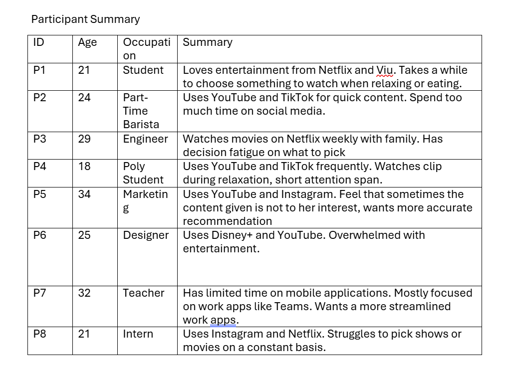
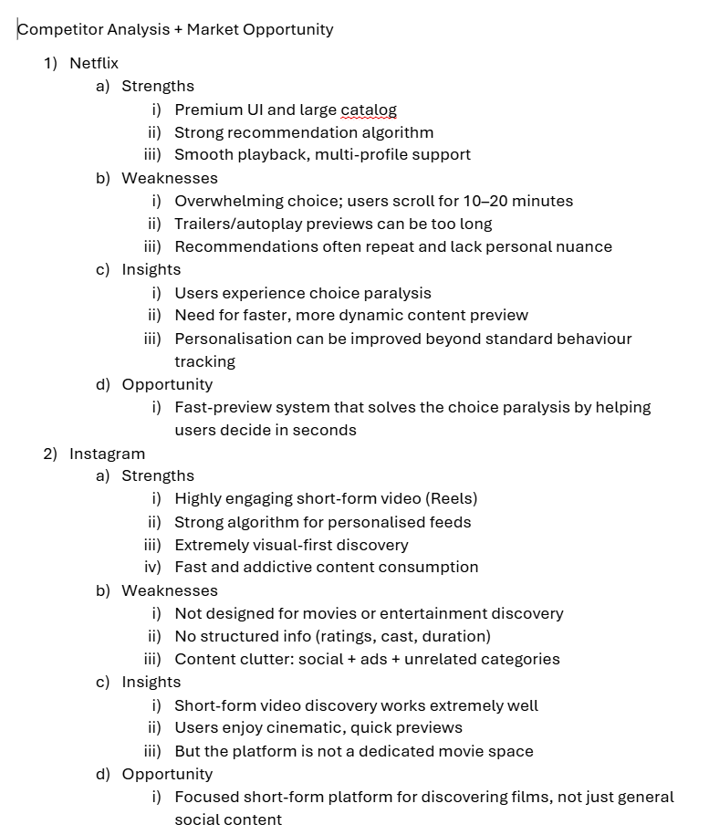
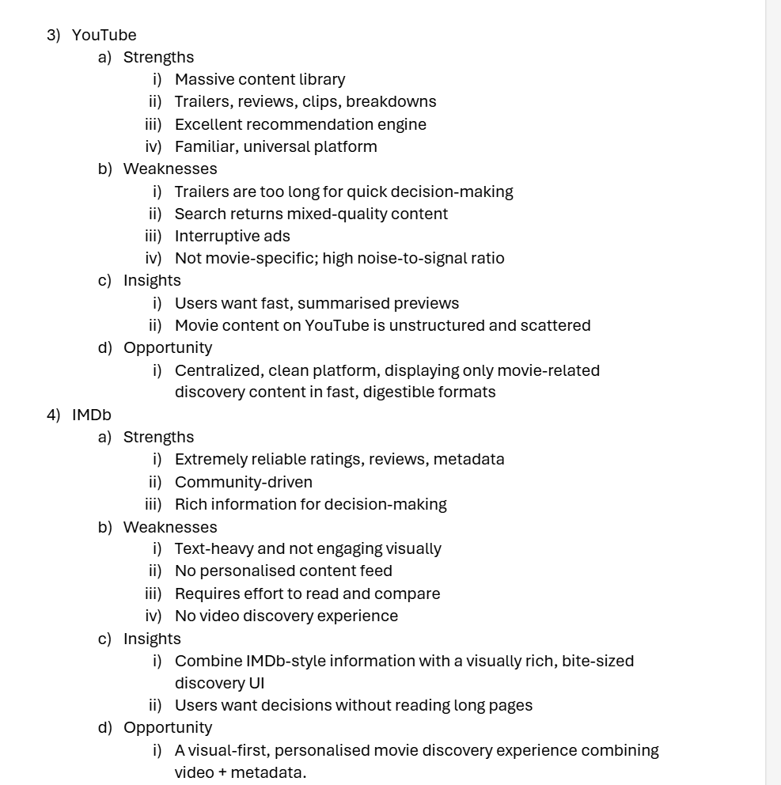
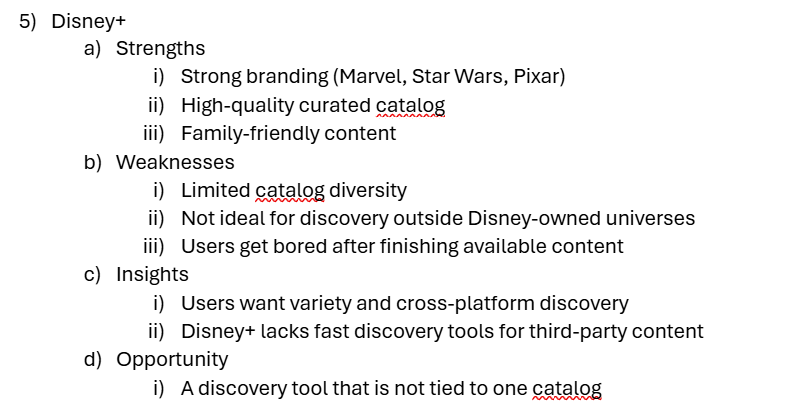
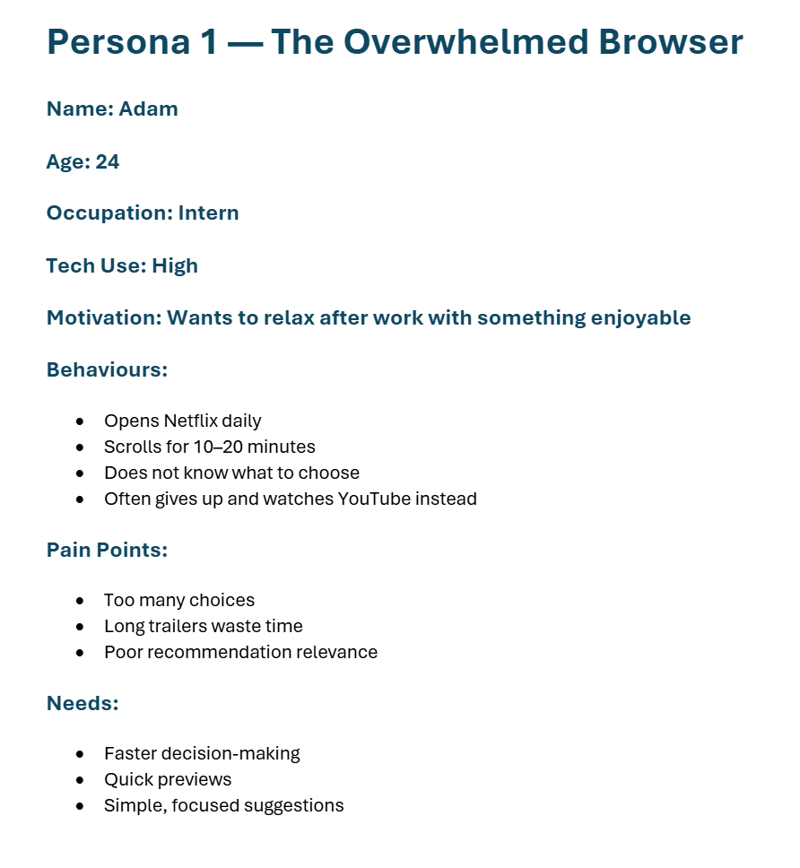
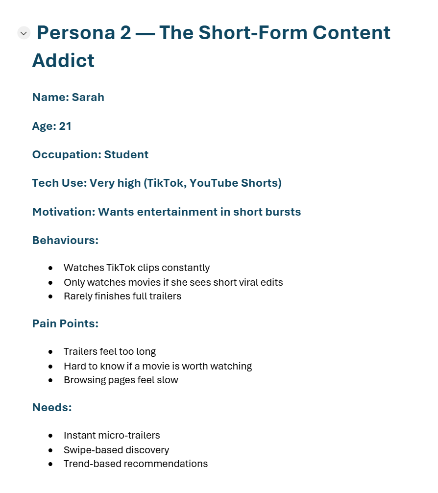
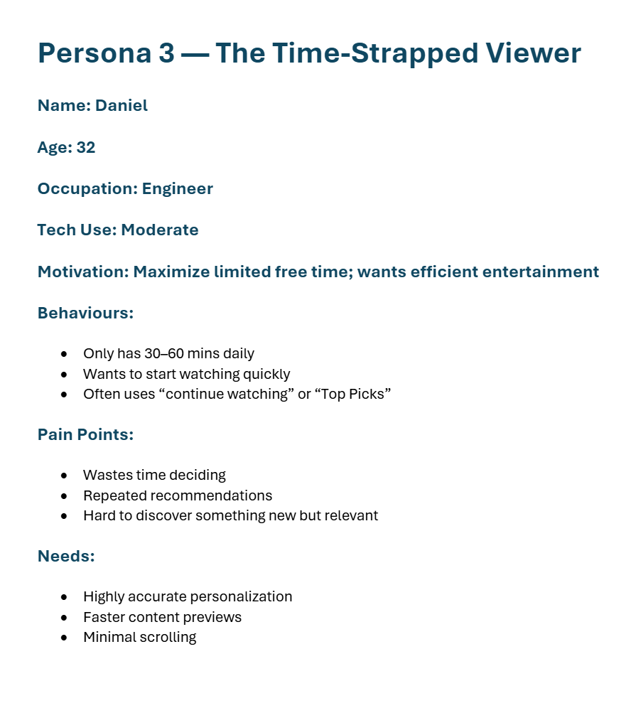

##Disclaimer
- This is a student assignment project for the Kotlin App
Development module at Ngee Ann Polytechnic. Developed for
educational purposes.

Collaborators
- Yong Kai Yu : S10258484 (GitHub: yongkaiyu)
- Tabio : S10258652 (GitHub: ITAccadh)
- Sarrinah : S10241803 (GitHub: srrnh)
- Jian Hui : S10257708 (GitHub: yonaginn)

Introduction
- This project is a mobile application prototype which is a personalized micro-trailer movie discovery app.
- The app assists users in discovering movies through engagement via short movie clips, displayed through a swipe-based interface inspired by modern social media content consumption.
- The app aims to reduce decision fatigue and help users discover more movies efficiently

Motivation/Objective

- Many users using streaming services like Netflix experience from choice fatigue and spend most of their time scrolling through large catalogs. Trailers are often long, and recommendations could feel repetitive.

Our objective is to create a mobile application that
- Helps users discover movies quickly and visually
- Uses short movie clips to give them a taste of what to expect
- Reduces the time on deciding what to watch
- Provides targeted personal movie suggestions
- Offers an intuitive interface with swipe-based interactions

- The Phase 1 prototype is aimed on displaying the basic features required to support the concept.

App Category

- Entertainment
- Movie Recommendation
- Media Streaming Support Tool
- Video Discovery

Declaration of LLM

- This project utilised the LLM of OpenAI ChatGPT, to assist with
- Brainstorming ideas and refining core concept
- Drafting of user research summaries
- Structuring documentation
- Clarifying Android development concepts
- Assisting in explanations regarding code logic

Tasks and features allocation of each member in team for Stage 1
- Research on what app to do for Stage 1 (Kai Yu)
- Creating and making of wireframes (Kai Yu)
- Conducting of user testing (Kai Yu)
- Login Page (Kai Yu)
- Login Database Implementation using Firebase(Kai Yu)
- Navigation UI Implementation (Kai Yu)
- Movie Shorts Player Discovery Feature on Home Screen (Kai Yu)
- Movie Database Implementation (Kai Yu)
- Horizontal List Trending Implementation (Kai Yu)
- Details Page Implementation (Kai Yu)
- Profile Page (Nagu)

Planned Tasks and Feature Allocation for each member in Stage 2
- Mood Movie Recommendation (Kai Yu)

Application Description
- CineXplorer is a discovery mobile application targeted towards movies. CineXplorer through its innovative features helps
users discover more targeted movies and reduce time on choosing what movie to watch. 
- One of CineXplorer's features helps quick discover movies through watching movie trailers in a Instagram/TikTok scrolling format.

Roles & Contributions of each member for Stage 1
- Research on what app to do for stage 1 (Kai Yu)
- Creating and making of wireframes (Kai Yu)
- Conducting of user testing (Kai Yu)
- Login Page (Kai Yu)
- Login Database Implementation using Firebase(Kai Yu)
- Navigation UI Implementation (Kai Yu)
- Movie Shorts Player Discovery Feature on Home Screen (Kai Yu)
- Movie Database Implementation (Kai Yu)
- Horizontal List Trending Implementation (Kai Yu)
- Details Page Implementation (Kai Yu)
- Profile Page (Nagu)

Research Questions

- Help to explore many domains before narrowing it down.

Daily Life & Pain Points

- What mobile applications do users spend the most time on?

- What are the most frustrating daily digital tasks?

- What causes users to feel overwhelmed, lost, or unproductive?

Usage

- What apps do users use daily or cannot live without?

- What apps did wish existed?

- What problems are not solved well by current mobile applications?

Research Method

- User Interviews (8 pax)

- Online Survey (20-30 responses)

- Competitor Scan (Instagram, CapCut, Netflix, Google, WhatsApp, Shopee )

Observed Behaviours

- Most users browse before watching

- Users are overwhelmed with options and abandon choices

- Short form video consumption are preferred

- Many prefer quick decisions over long browsing sessions

Interview Responses

- I think the YouTube and TikTok short clips help me decide faster. (P4)

- Trailers are long. I think quick previews of what I am shown would be nicer to have. (P2)

- I don’t think the content given to me is for me. (P5)

- I always finish my food before I even chose a movie to watch. (P1)

- I always take a lot of time choosing what I watch. (P8)

- I would love to have a movie to watch immediately with my family. (P3)

Survey Findings (24 responses)

How long do you spend deciding what to watch?

- 62%: 10 minutes to 25 minutes

Do you feel overwhelmed by too many choices?

- 75%: Yes

Do current recommendations feel relevant?

- 58% : No

Would short previews help decide faster?

- 79% : Yes

Do you watch TikTok short style clips?

- 2% : Frequently

Do you finish full trailers?

- 37% : Rarely 

Findings

- Majority suffers decision fatigue

- High Preference for short style video

- Users want faster discovery, not more content

- Recommendation systems are repetitive 

Competitive Observations

- Netflix “Too much scrolling”, “repetitive suggestions”

- YouTube: “Not organized for movies”

- TikTok: “Great for fast reviews”, “not made to watch movies” 

Insights from data

- People send significant time relaxing using digital entertainment.

- Entertainment is consistently one of the most used categories

- Users frequently complain about having difficulties on choosing what to watch 

Consolidated Insights

Insight 1 – Decision Fatigue

- Users waste time choosing what to watch and feel overwhelmed by endless options

Insight 2 – Long Trailers Are Not Effective

- Users prefer like short highlight clips which are the “juicy” parts than trailers

Insight 3 – Irrelevant Recommendations

- Users dont feel suggestions are to their tastes; want personalization

Insight 4 – Short Attention Span

- Short-form content (10-30 sec clips) strongly influences their decision

Insight 5 – Users Want Quick, Confident Choices

- They prefer simple, fast browsing over complex menus 

Ideas:

- Movie Discovery through Instagram Reels style scrolling

- Mood-Based Movie Picker

- Smart Playlists for Movies

- Social Movie Sharing Cards

- Eliminating categories Mode

- Swipe-to-Discover Interface

- Weekly Movie Digest 